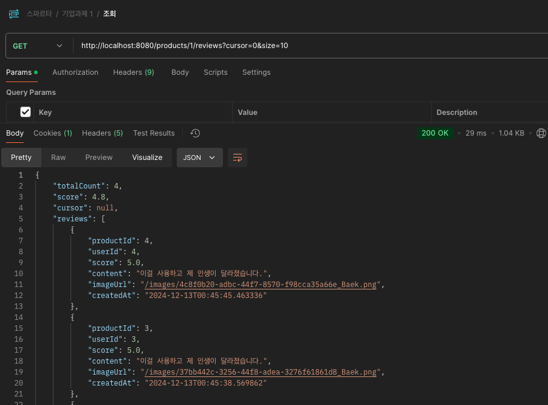
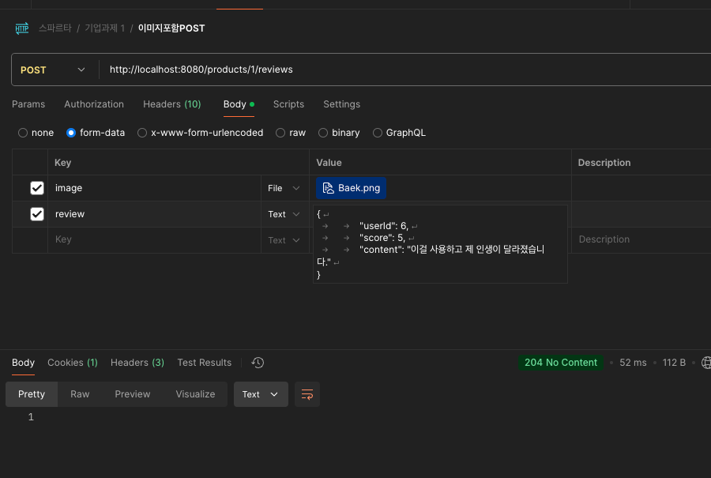

# Review API 

## 1. 프로젝트 개요 
* 상품 리뷰를 작성하고 조회할 수 있는 REST API
* **Docker-compose**를 활용하여 실행 환경을 구성하였으며, 쉽게 테스트할 수 있게 설계되었습니다.
* Postman을 통해 API를 테스트할 수 있도록 설계되었습니다.

---

## 2. 기술 스택

* **언어** : Java17
* **프레임워크** : Spring Boot 3.x
* **데이터베이스** : MySQL 8.036
* **도구** : Docker , Docker Compose
* **빌드** : Gradle
* **API 테스트 도구**: Postman

___
## 3. 기술적 고민 및 해결

### 1. 동시성 문제 방지
- **고민**:
      - 여러 사용자가 동시에 리뷰를 작성할 경우 데이터 무결성 문제 발생 가능.
      - 평균 점수와 리뷰 개수를 정확하게 유지해야 함.
- **해결**:
      - 낙관적 락(Optimistic Lock)을 사용하여 동시성 문제 방지하도록 설계.
      - `@Version` 필드를 엔티티에 추가하고, 데이터 충돌 시 HTTP 409 응답 반환.
- **결과**:
      - 동시성 문제를 방지하기 위한 설계가 적용되었으나, 실제 테스트는 진행하지 않음.


---

### 2. 인덱스 최적화
- **고민**:
      - 대규모 데이터에서 리뷰 조회 쿼리의 성능 개선 필요.
- **해결**:
      - 복합 인덱스를 생성하여 `product_id`와 `created_at` 컬럼을 최적화.
- **결과**:
      - 리뷰 조회 성능 개선 및 안정적인 데이터 조회 제공.

---

## 4.주요 기능 
* **리뷰 등록** : 특정 상품에 리뷰 등록
* **리뷰 조회** : 상품별 리뷰와 통계(평균 점수 및 리뷰 개수) 제공
* **동시성 문제** :낙관적 락(@Version)을 사용하여 데이터 무결성을 설계
      
----
## 5. API 요청/응답 예시 

### 리뷰 조회 (GET /products/{id}/reviews)
- 아래는 Postman을 통해 API 테스트한 결과입니다.

**조회**


### 리뷰 등록 (POST /products/{id}/reviews)
**등록**

---


## 6. Docker 기반 실행 방법 

1. **Docker 설치**
* [Docker 공식 홈페이지](https://www.docker.com/)에서 Docker Desktop 설치.

2. **Docker Compose 파일**
* 프로젝트 루트 디렉토리에 'docker-compose.yml'이 있어야 합니다.
* 다음과 같이 작성해야합니다.
```yaml
version: '3.8'
services:
  mysql:
    image: mysql:8.0.36
    container_name: <>
    ports:
      - "3307:3306"
    environment:
      MYSQL_ROOT_PASSWORD: <비밀번호>
      MYSQL_DATABASE: <>
      MYSQL_USER: <사용자명>
      MYSQL_PASSWORD: <비밀번호>
    volumes:
      - mysql_data:/var/lib/mysql
      - ./src/main/resources/static/images:/app/static/images
    healthcheck:
      test: ["CMD", "mysqladmin", "ping", "-h", "localhost"]
      interval: 10s
      timeout: 5s
      retries: 5
    restart: always

  sparta_reviewapi:
    build: .
    container_name: <>
    ports:
      - "8080:8081"
    environment:
      SPRING_DATASOURCE_URL: jdbc:mysql://{}:3306/{}
      MYSQL_USER: <사용자명>
      MYSQL_PASSWORD: <비밀번호>
    depends_on:
      mysql:
        condition: service_healthy
    restart: always

volumes:
  mysql_data:
```
3. Docker 명령어
```text

1. 컨테이너 실행
- 애플리케이션 및 MySQL 컨테이너를 실행합니다.
    docker-compose up --build

2.컨테이너 상태 확인
- 실행 중인 컨테이너를 확인합니다.
    docker ps

3. 컨테이너 로그 확인
- 특정 컨테이너의 로그를 확인합니다.
    docker logs <컨테이너 이름>

4. 컨테이너 정지 및 삭제 
- 실행 중인 컨테이너를 정지하고 삭제합니다.
    docker-compose down

5.Docker 이미지 및 컨테이너 정리
- 사용하지 않는 Docker 이미지 및 컨테이너를 정리합니다.
    docker system prune -a
```

